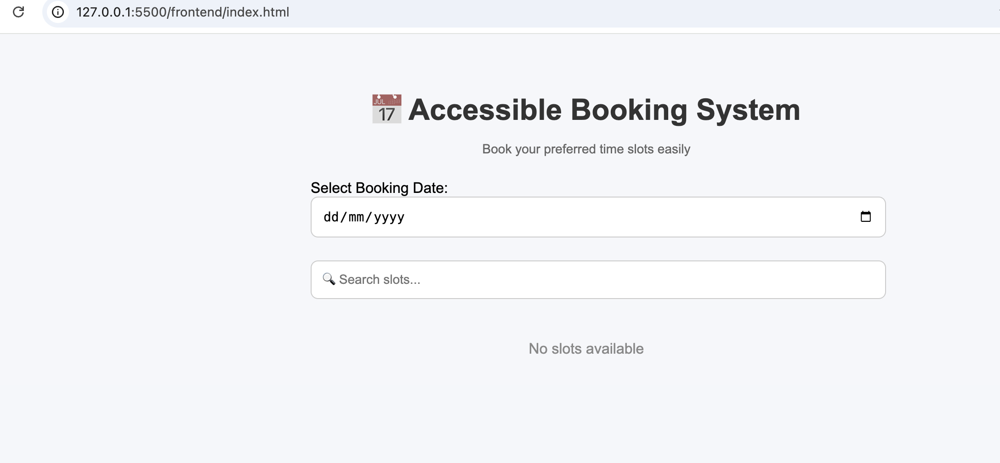

# Accessible Booking System

This project demonstrates implementation aligned with mitigation plan requirements.

## 🔧 Frontend (JavaScript)
- Async API calls for efficient data fetching
- Debounced search to optimise performance

## ⚙️ Backend (API)
- Structured schema design
- Indexed queries for performance

## 🗄️ Database
- Users management
- Booking handling
- Availability tracking

## ♿ Accessibility
- Fully keyboard accessible navigation
- Focus management and ARIA considerations

## 🏗️ Governance
- Git-based workflow
- CI/CD ready structure

## 🚀 Outcome
Improved performance, accessibility, and maintainability aligned with mitigation plan.

## 📸 Demo

